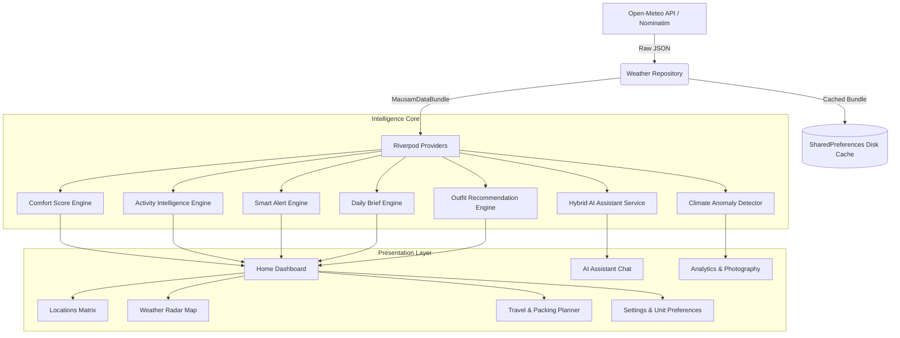

# Mausam 🌦️ — AI-Powered Personalized Weather Intelligence Platform

[](https://flutter.dev)
[](https://dart.dev)
[](https://riverpod.dev)
[](LICENSE)
[](test/)

**Mausam** is a production-grade, cross-platform (Android, iOS, Web, Desktop) weather intelligence platform built with Flutter. Unlike traditional weather apps that only dump raw temperature numbers, Mausam translates real-time atmospheric conditions into **actionable lifestyle intelligence**, **smart comfort scores**, **contextual outfit recommendations**, **radar maps**, and a **grounded AI weather assistant**.

---

## 🌟 Key Highlights & Features

### 1. 🌦️ Weather Comfort Score Engine (0–100)
A deterministic multi-factor index combining:
- **Thermal Sensation (25%)**: Apparent feels-like temperature curve.
- **Precipitation Risk (20%)**: Rain intensity and hourly probability.
- **Air Quality & Respiratory Safety (15%)**: Real-time European AQI & PM2.5 levels.
- **Relative Humidity (15%)**: Dew point, sticky index, and skin transpiration.
- **Wind Speed (15%)**: Wind chill and gust severity.
- **Solar UV Index (10%)**: Erythemal sun damage risks.

Includes **primary factor attribution** that dynamically explains why a score is high or suppressed.

### 2. ⚡ Activity Intelligence & Time-Window Recommendation
Evaluates and ranks **10 core activities** with individual suitability scores (0–100), optimal time windows, avoid windows, and hazard warnings:
- 🏃 **Running & Jogging**
- 🚴 **Road & Mountain Cycling**
- 🚶 **Walking & Light Strolling**
- 🏋️ **Gym & Indoor Fitness**
- ⚽ **Outdoor Sports**
- 📸 **Photography (Golden Hour / Blue Hour)**
- 🥾 **Hiking & Trail Trekking**
- 🎉 **Outdoor Gatherings & Picnics**
- 🚗 **Commuting & Transit**
- ✈️ **Travel & Flight Transit**

### 3. 🤖 Grounded AI Weather Assistant
Natural language conversational interface:
- **Zero Hallucinations**: Every response is strictly grounded in live sensor forecasts (temperature, feels-like, AQI, UV, rain probability).
- **Hybrid Architecture**: Leverages OpenAI (`gpt-4o-mini`) or Google Gemini (`gemini-1.5-flash`) when keys are supplied, or seamlessly falls back to an **instant offline Deterministic Rule Engine** requiring zero keys and zero network tokens.
- Interactive quick-prompt chips ("Will it rain today?", "What should I wear?", "Can I go for a run?").

### 4. 🗺️ Multi-Layer Weather Radar & Map
Simulated radar contours and geographic atmospheric overlays:
- 🌡️ **Temperature Heatmap**
- 🌧️ **Precipitation Doppler Radar**
- 💨 **Wind Speed Streamlines**
- 😷 **Air Quality (AQI) Smog Map**
- Real-time coordinate inspection and multi-resolution zoom.

### 5. 🏙️ "My Places" Matrix & Side-by-Side Comparison
- Save unlimited cities with semantic tags: `🏠 Home`, `🎓 College`, `💼 Work`, `📍 Custom`.
- Favorite toggles and drag-and-drop reordering.
- **Side-by-Side Comparison Matrix**: Compare 2+ cities simultaneously across temperature, feels-like, comfort score, rain risk, wind, and AQI.

### 6. 🧳 Smart Travel & Packing Planner
- Select any destination with date range pickers.
- Forecast outlook with min/max temperatures and precipitation risk.
- **Context-Aware Packing Checklist**: Generates essential gear (clothing layers, umbrella, sunscreen, sunglasses, chargers, hydration) tailored to the destination's predicted climate.

### 7. 📊 Historical Climate Trends & Photography Studio
- **Historical Trends**: 7-day, 30-day, 90-day, and 1-year historical temperature and precipitation charts powered by Open-Meteo's historical archives.
- **Photography Studio**: Golden hour, blue hour, solar noon calculation, and a specialized outdoor photography lighting score.
- **Climate Anomaly Detector**: Statistical z-score anomaly detection comparing current conditions against the 14-day baseline.

### 8. 🎭 8 Adaptive Lifestyle Personas
Personalizes the dashboard widgets according to your daily goals:
- 🌿 **Health-Conscious**: AQI, Pollen Count, UV Index, Humidity.
- 🏃 **Outdoor Fitness**: Sunrise/Sunset, Best Run Hours, Wind, Heat Alerts.
- 🏄 **Beachgoer / Surfer**: Wave Height, Swell Direction, Sea Temperature.
- ✈️ **Traveler**: Multi-city cards, flight alerts, packing checklist.
- 👨‍👩‍👧 **Parent / Family**: School commute conditions, afternoon rain alerts.
- 🌱 **Agriculture**: Soil moisture (0–10 cm), evapotranspiration (ET0).
- 🚗 **Commuter**: Road visibility, fog advisory, traffic weather synergy.
- 🎉 **Event Planner**: Comfort index, best event days, weather stability.

### 9. 🔄 Unit Converter & Smart Alerts
- Full unit switching across **°C / °F**, **km/h / mph / m/s**, and **hPa / inHg**.
- User-customizable smart threshold alert toggles with automatic deduplication.
- **Resilient Offline Cache**: Persists full data bundles locally on disk for zero-latency startup.

---

## 🏛️ Architecture Overview



---

## 📁 Codebase Structure

```
lib/
├── app.dart                                # MaterialApp, GoRouter navigation, theme binding
├── main.dart                               # Initialization, dotenv, crash safety
├── core/
│   ├── constants/                          # Personas, AQI bands, API endpoints
│   ├── errors/                             # Standardized WeatherAppException hierarchy
│   ├── theme/                              # Light & Dark Material 3 color palettes
│   └── utils/                              # UnitConverter, formatters, packing logic
├── data/
│   ├── models/                             # WeatherModel, HourlyWeather, DailyWeather, AirQualityModel, MarineModel, LocationModel
│   ├── repositories/                       # WeatherRepository abstraction + OpenMeteo implementation
│   └── services/                           # OpenMeteoService, StorageService, GeocodingService, WeatherAIService
├── engines/
│   ├── comfort_score_engine.dart           # Multi-factor Comfort Score (0-100)
│   ├── activity_intelligence_engine.dart   # 10 Activity suitability models & time slots
│   ├── smart_alert_engine.dart             # Threshold notifications with cooldown
│   ├── daily_brief_engine.dart             # Structured daily weather briefing
│   ├── outfit_recommendation_engine.dart   # Thermal & UV clothing suggestions
│   └── anomaly_detection_engine.dart       # Statistical z-score outlier detection
├── providers/
│   ├── weather_provider.dart               # MausamDataBundle & repository provider
│   ├── location_provider.dart              # GPS & Saved Cities notifier
│   ├── persona_provider.dart               # Active persona & user settings
│   ├── intelligence_provider.dart          # Riverpod bindings for engines & alert preferences
│   ├── ai_assistant_provider.dart          # Chat state notifier & conversational history
│   └── unit_provider.dart                  # Reactive UnitSettings notifier
├── screens/
│   ├── home/                               # Dashboard with intelligence stack
│   ├── locations/                          # My Places & Comparison Matrix
│   ├── map/                                # Interactive Weather Radar & Canvas Contours
│   ├── assistant/                          # AI Weather Chat with quick chips
│   ├── travel/                             # Travel & Trip Packing Planner
│   ├── analytics/                          # Historical charts & Photography Studio
│   ├── settings/                           # Unit preferences, alerts, persona picker
│   └── onboarding/                         # Initial persona onboarding flow
└── widgets/
    ├── common/                             # WeatherCard, AlertBanner, ShimmerLoaders
    ├── home/                               # Hero banner, ComfortScoreCard, DailyBriefCard, ActivityCard, OutfitCard, AiAskBar
    └── personas/                           # 8 persona-specific widget kits
```

---

## 🚀 Getting Started

### Prerequisites
- **Flutter SDK**: 3.47.0 or higher
- **Dart SDK**: 3.13.0 or higher
- Chrome (for web development), Android Studio, or VS Code

### Installation

1. **Clone the repository**:
   ```bash
   git clone https://github.com/shivangsaxena1011/weather.git
   cd weather
   ```

2. **Configure Environment Variables (Optional)**:
   Copy `.env.example` to `.env`:
   ```bash
   cp .env.example .env
   ```
   > **Note**: An API key is **NOT required** for full weather, air quality, marine, geocoding, radar, or local rule-based AI assistance. All essential features work out of the box with zero keys.

3. **Install Dependencies**:
   ```bash
   flutter pub get
   ```

4. **Verify Code Quality**:
   ```bash
   flutter analyze
   flutter test
   ```

5. **Run the Application**:
   ```bash
   # Run on Chrome (Web)
   flutter run -d chrome

   # Run on Android Device / Emulator
   flutter run -d android

   # Run on Windows Desktop
   flutter run -d windows
   ```

---

## 🧪 Testing & Verification

The platform comes with a comprehensive unit and widget test suite covering mathematical models, conversion logic, alert thresholds, and AI response generators:

```bash
flutter test
```

### Test Coverage Highlights:
- `test/unit/comfort_score_engine_test.dart`: Validates optimal thermal indices, penalty attributions, and score boundaries.
- `test/unit/activity_intelligence_engine_test.dart`: Tests all 10 activity recommendation models, severe storm warnings, and gym indoor fallbacks.
- `test/unit/smart_alert_engine_test.dart`: Validates storm detection, extreme heat alerts, and preference toggles.
- `test/unit/anomaly_detection_engine_test.dart`: Tests statistical z-score outlier logic against forecast baselines.
- `test/unit/unit_converter_test.dart`: Verifies Celsius, Fahrenheit, km/h, mph, m/s, hPa, and inHg conversions.
- `test/unit/ai_weather_service_test.dart`: Validates conversational grounding for rain, workouts, clothing, and travel queries.
- `test/widget_test.dart`: Verifies full application tree pump and routing.

---

## 🌐 External APIs & Attributions

Mausam is architected for **zero operational cost**:
- **Weather & Historical NWP**: [Open-Meteo](https://open-meteo.com) (CC BY 4.0) — High-resolution global forecast models (ECMWF, GFS, ICON).
- **Atmospheric Air Quality**: [Open-Meteo Air Quality API](https://open-meteo.com/en/docs/air-quality-api) — European AQI, PM2.5, PM10, Nitrogen Dioxide, Ozone.
- **Marine & Ocean Conditions**: [Open-Meteo Marine API](https://open-meteo.com/en/docs/marine-weather-api) — Wave height, wave period, swell direction, sea temperature.
- **Geocoding & Reverse Search**: [Nominatim / OpenStreetMap](https://nominatim.org) and Open-Meteo Geocoding.
- **Traffic (Optional)**: [TomTom Traffic Flow API](https://developer.tomtom.com) for real-time traffic slowdowns.

---

## 📄 License
This project is licensed under the [MIT License](LICENSE).
